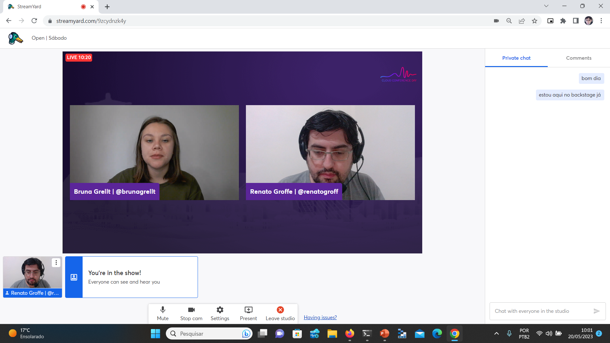
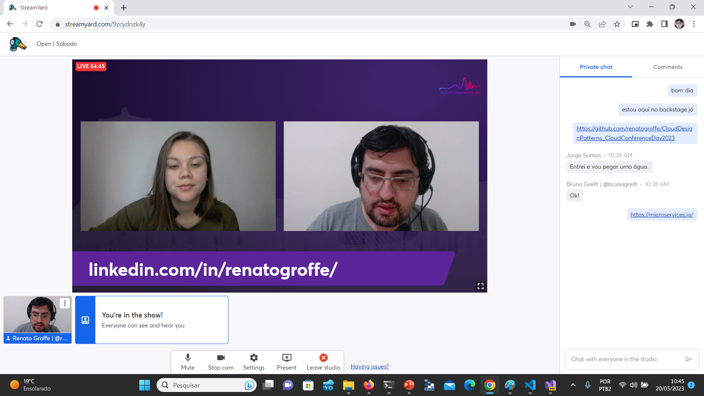
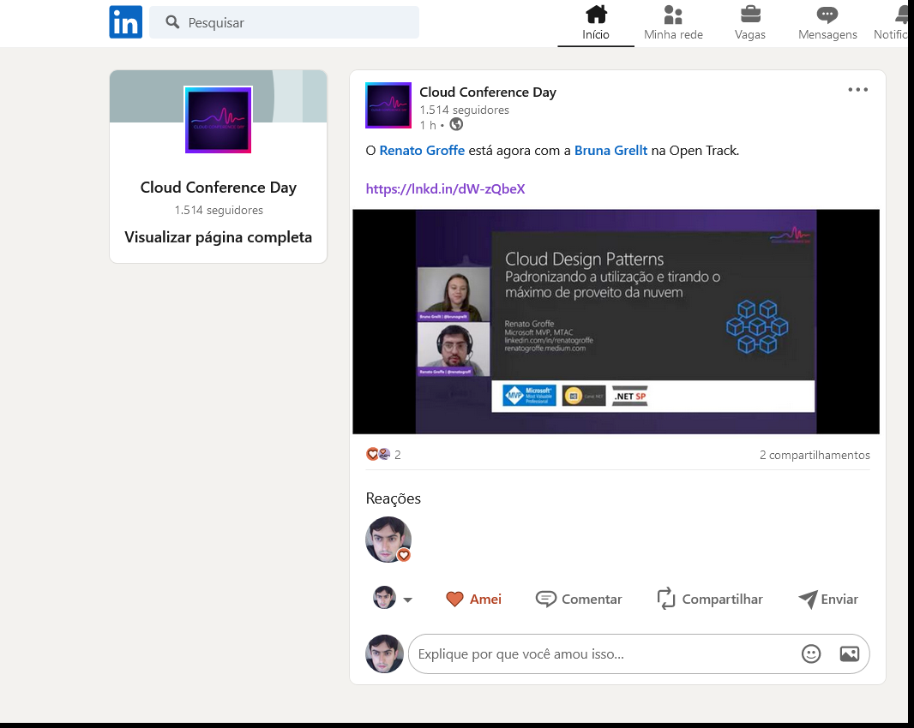
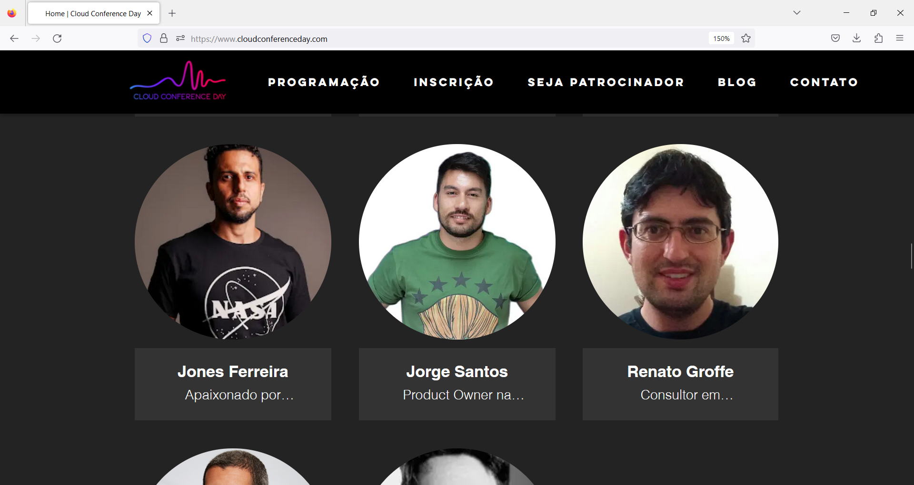

# CloudDesignPatterns_CloudConferenceDay2023
Exemplos de implementação de Cloud Design Patterns apresentados durante o Cloud Conference Day em 20/05/2023.

---

Título da Apresentação: **Cloud Design Patterns: padronizando a utilização e tirando o máximo de proveito da nuvem**

Data: **20/05/2023 (sábado)**

Tipo do evento: **Online**

Ferramenta de transmissão: **Streamyard**

Tecnologias e tópicos abordados: **Microsoft Azure, Kubernetes, Cloud Design Patterns, Design Patterns, Solutions Architecture, Software Architecture, Cloud Native, .NET 7, ASP.NET Core**

Número de participantes: **25 pessoas (estimativa)**

Link do evento: [**LinkedIn**](https://www.linkedin.com/posts/cloud-conference-day_o-renato-groffe-est%C3%A1-agora-com-a-bruna-grellt-activity-7065673369517453312-tRDu?utm_source=share&utm_medium=member_desktop)

Site do evento: **https://www.cloudconferenceday.com/**

Deixo aqui meus agradecimentos à **Bruna Grellt** e ao **Rhuan Rocha** por todo o apoio para que eu partipasse como palestrante de mais uma edição do **Cloud Conference**.

---

